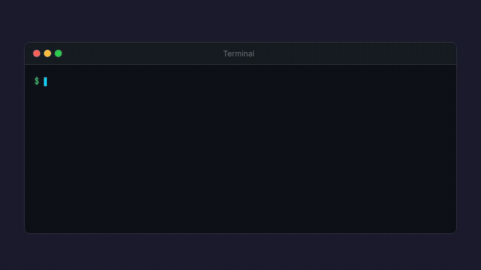

# cc-statusline — with real-time subscription usage limits

A status bar for [Claude Code](https://docs.anthropic.com/en/docs/claude-code) that shows session info and (optionally) real-time subscription usage.


**Line 1** — model, project path, git branch, uncommitted changes, context window usage, session cost

**Line 2** — Claude subscription usage limits (5-hour and 7-day windows) with reset countdowns

## How it works


Claude Code pipes session JSON to `statusline.sh` on every response. The script renders line 1 directly from that JSON (using `jq`).

Line 2 pulls data from the Claude usage API (`claude.ai/api/organizations/.../usage`). This endpoint is protected by Cloudflare's managed challenge, so it can't be queried with plain `curl`. To surface what's already available to the user but in a much simpler way, a companion Chrome extension leverages the browser's existing authenticated session: `statusline.sh` connects to `host.py` over a Unix socket, which signals `background.js` to make the API request using the browser's cookies, then pipes the JSON response back through the chain.

Fetches are **debounced** (max once per 5 seconds). During streaming responses, only the first statusline call triggers a real API fetch — the rest use cached data.

## Prerequisites

**All installs**
- macOS (Chrome native messaging paths are macOS-specific)
- `jq` on `$PATH`

**Full install (with usage data)**
- Google Chrome — logged in to [claude.ai](https://claude.ai) and able to view [claude.ai/settings/usage](https://claude.ai/settings/usage)
- `python3` on `$PATH`

## Setup



### Quick install (curl one-liner)

```bash
# Full install (with Chrome extension for usage data — Line 1 + Line 2)
curl -fsSL https://raw.githubusercontent.com/sholub1989/cc-statusline/master/install.sh | bash

# Without Chrome extension (single-line: session info only — Line 1)
curl -fsSL https://raw.githubusercontent.com/sholub1989/cc-statusline/master/install.sh | bash -s -- --no-chrome-extension
```

The full install downloads all files to `~/.claude/extensions/cc-statusline/`, registers the native messaging host, and configures Claude Code. Then load the Chrome extension — the installer prints the exact steps, but in short:

```bash
open ~/.claude/extensions/cc-statusline
```

1. Open `chrome://extensions` and enable **Developer mode** (top-right toggle)
2. Drag the `cc-statusline` folder from Finder onto the `chrome://extensions` page
3. Open a Claude Code session — you should see the statusline

> The Chrome extension loading steps above apply to the full install only.

### Developer install (git clone)

```bash
git clone https://github.com/sholub1989/cc-statusline.git
cd cc-statusline

# Full install (with Chrome extension for usage data — Line 1 + Line 2)
./install.sh

# Without Chrome extension (single-line: session info only — Line 1)
./install.sh --no-chrome-extension
```

The installer copies extension files to `~/.claude/extensions/cc-statusline/` and prints the drag-and-drop instructions (full install only).

> **Note:** If you move the cloned repo, re-run `./install.sh` to update paths.

## Troubleshooting

**Line 2 doesn't appear**
- Check `chrome://extensions` for errors on the extension
- Open the service worker console and look for error messages
- Verify `ls /tmp/claude-usage.sock` exists (created when the extension loads)
- Make sure you're logged in to claude.ai in Chrome

**"Native host disconnected" in service worker console**
- Re-run `./install.sh` to re-register the host
- Reload the extension in `chrome://extensions`

**Usage data is stale**
- The statusline only fetches when Claude Code renders it (on each response)
- Data is debounced to 5-second intervals — this is intentional to avoid overloading the API

## Uninstall

From the repo (or wherever you have the script):

```bash
./uninstall.sh
```

Then remove the extension from `chrome://extensions`.
