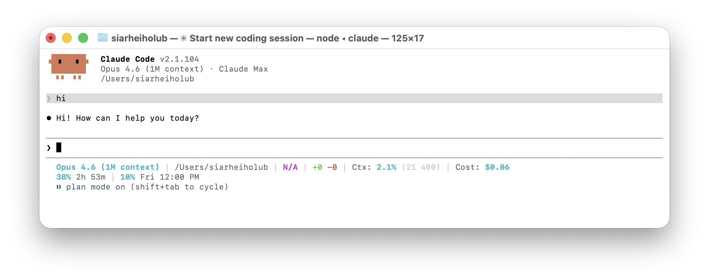
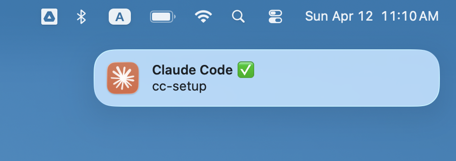
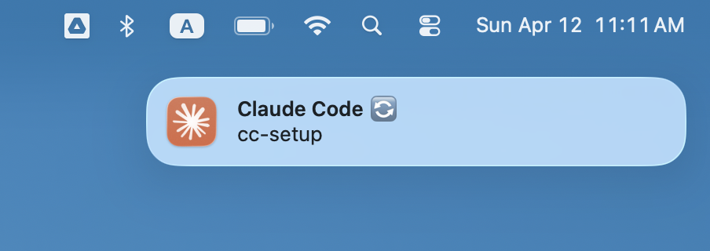

# cc-setup

A status bar and native macOS notifications for [Claude Code](https://docs.anthropic.com/en/docs/claude-code).

---

## Statusline



**Line 1** — model, project path, git branch, uncommitted changes, context window usage, session cost

**Line 2** — Claude subscription usage limits (5-hour and 7-day windows) with reset countdowns

### Prerequisites

- macOS
- `jq` on `$PATH`

### Setup

```bash
curl -fsSL https://raw.githubusercontent.com/sholub1989/cc-setup/master/install.sh | bash
```

#### Developer install

```bash
git clone https://github.com/sholub1989/cc-setup.git
cd cc-setup
./install.sh
```

### Troubleshooting

**Line 2 doesn't appear**
- Rate limit data is provided by Claude Code itself — ensure you're on a version that includes `rate_limits` in statusline JSON input

### Uninstall

```bash
curl -fsSL https://raw.githubusercontent.com/sholub1989/cc-setup/master/uninstall.sh | bash
```

---

## Notifications

Native macOS notifications when Claude Code needs your attention — visible on any screen, not just the terminal.

| Task complete / question | Permission prompt |
|---|---|
|  |  |

Shows the project name so you know which session needs you. Covers all events where Claude is waiting:

| Event | Notification |
|---|---|
| Task complete / question | `Claude Code ✅` |
| Permission prompt (Bash, file edit, etc.) | `Claude Code 🔄` |
| MCP server input request | `Claude Code 💬` |

### Prerequisites

- macOS
- Swift compiler (`swiftc`) — included with Xcode Command Line Tools
- `jq` on `$PATH`

### Setup

```bash
curl -fsSL https://raw.githubusercontent.com/sholub1989/cc-setup/master/install-notifications.sh | bash
```

On first run, macOS will ask you to allow notifications for **ClaudeNotify** — click Allow. Restart Claude Code to activate the hooks.

#### Developer install

```bash
git clone https://github.com/sholub1989/cc-setup.git
cd cc-setup
./install-notifications.sh
```

### Configuration

Edit `~/.claude/scripts/notify.sh` to customize:

- **Disable sound** — remove `--sound` from the last line
- **Change debounce** — adjust the `5` (seconds) in the debounce check

### Roadmap

- Interactive notification actions (e.g. text-to-speech playback button)

### Uninstall

```bash
curl -fsSL https://raw.githubusercontent.com/sholub1989/cc-setup/master/uninstall-notifications.sh | bash
```
